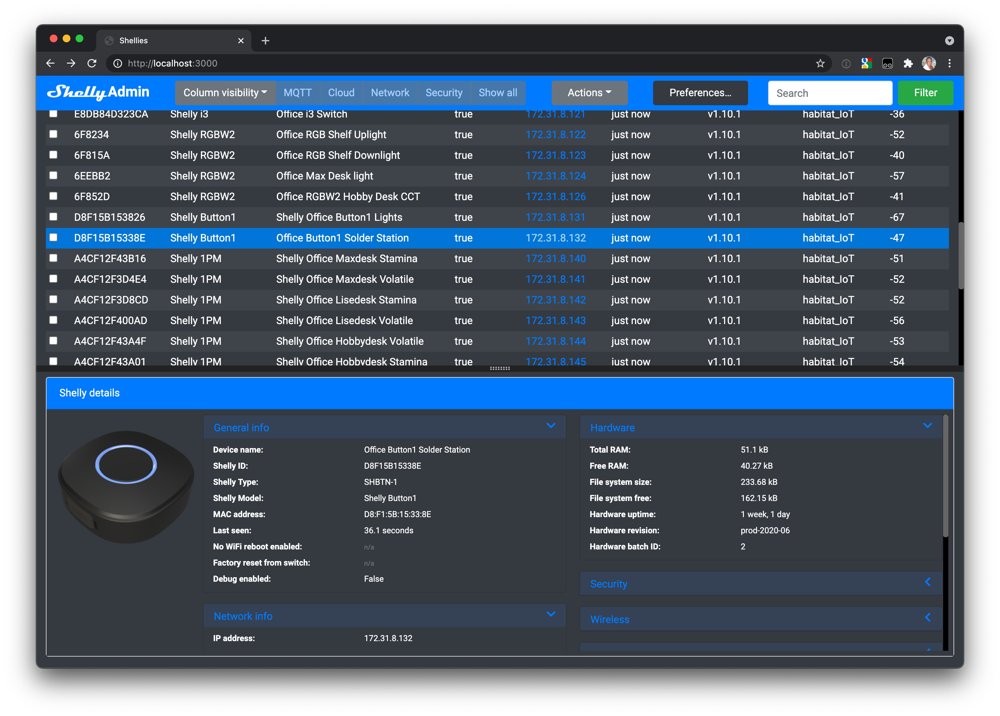

# Shelly Admin HomeAssistant Add-on

Handles discovery and communication with [Shelly](https://shelly.cloud) devices using [CoAP](http://coap.technology) over HTTP.

An administration console written to manage a whole network of Shellys and to enure that their configuration is homogenous. The user interface is  entirely HTML5 and built upon Bootstrap 4 and Pug (née Jade) page templates.

The applications, by design, does not work with or rely on Shelly Cloud. Device discovery is currently implemented via CoAP thanks to the awesome work of [Alexander Rydén](https://github.com/alexryd) for his contribution to the [Shellies](https://github.com/alexryd/node-shellies) NPM project. I fully intend to add MQTT discovery soon after the inital CoAP based release. I may also add IP range scanning if there is demand.

The user interface is designed to be dynamic and will automatically update in realtime as Shelly devices appear, change or go offline. Where possible this is acheived via push notifcations from each device using CoAP or MQTT but also falls back to the direct device API calls over http where push events are not supported.

This is prerelease software and is not yet feature complete. For ease of development this project is packaged as a NodeJS web server driving an HTML5 web browser (Safari, Chrome, Firefox, Edge etc). The stand-alone Electron versions to deliver native binaries on MacOS and Windows will follow closer to functional completion.

I am looking for interested parties that would like to collaborate, either with pull requests or end-user testing. Please contact me by [email](email:shellyadmin@lyth.name) if you want to be involved or have any questions.
